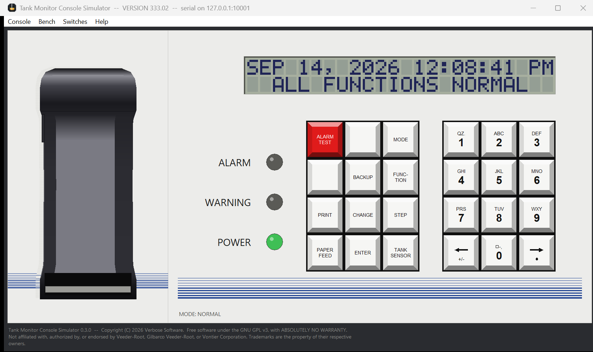

# Tank Monitor Console Simulator

A training simulator for TLS-350 compatible tank monitor consoles. It aims to
be a one-to-one copy of the real console: the front panel, the card cage, the
setup and diagnostic screens, the printer, and the serial protocol any TLS
tool can connect to. If a real console does it, this one is meant to do it the
same way.

Built to practise on and to test against, without a console on the bench.



## Installing it

On Windows, download from the
[latest release](https://github.com/ghostrdr-ctrl/Tank-Monitor-Console-Simulator/releases).
There are two downloads and they are the same program:

- **`...-Setup.exe`** installs it per-user, with no administrator rights and
  no UAC prompt. Take this one unless it will not download.
- **`...-Portable.zip`** is a folder to extract and run, with nothing
  installed and nothing to uninstall. Take this one if your workplace blocks
  the `.exe` download, which some do without offering a way past it. It
  carries a `HOW-TO-RUN.txt` that says what to do with it.

Both are currently unsigned, so SmartScreen warns on first run; check your
download against the release's `SHA256SUMS.txt`. Help then Check for updates
fetches new versions from the same place, and fetches the installer.

## Running from source

Python 3.8 or newer, standard library only. Tkinter for the window, which
ships with Python on Windows and macOS and is `python3-tk` on Debian and
Ubuntu. Nothing to install.

```
python run.py                     console window and bench window, serial on 127.0.0.1:10001
python run.py --port 10002        somewhere else
python run.py --seed site.vrset   start out looking like a real site
python run.py --headless          serial only, no window
python run.py --xport             also emulate the Lantronix XPort (setup menu, discovery)
python -m unittest discover tests
```

Point a tool at `127.0.0.1` and the port it prints.

## Using it

Because it is a one-to-one copy, operate it the way you operate a real
console: the same keys, the same MODE and FUNCTION and STEP walk, the same
setup and diagnostic menus. The manufacturer's manuals are the manual for this
simulator too. Program it, read it over the serial port, print from it, and it
answers as the hardware answers.

## What this adds around the console

The console is faithful; the parts around it are what make it a bench.

- **The site, drawn as a site.** A separate bench window shows each tank as a
  buried cylinder with a probe down it. Drag the product float to set the fuel,
  drag the water float to set the water under it, and the console gauges what
  you set. Sensors, lines and dispensers are there too, and the alarms follow
  from the physical state against the limits you programmed.
- **A probe you can unplug**, at the connector on the tank, which raises the
  Probe Out alarm the way a pulled probe does in the field.
- **The Lantronix XPort** inside the TCP/IP Interface Module is emulated: the
  telnet setup menu on port 9999 and Lantronix DeviceInstaller discovery on
  UDP 30718, alongside the serial tunnel. Off until you start it.
- **A self-updater.** Help then Check for updates fetches and verifies new
  releases.
- **A Windows installer** with a per-user install that needs no administrator
  rights, and an in-app update from there on.

## Licence

GNU General Public License, version 3 or later. See `LICENSE`. Use it, study
it, share it, change it; a version you pass on stays GPL-3.0 and its source
reaches whoever receives it.

## Not affiliated

This program is not affiliated with, authorized by, sponsored by, or endorsed
by Veeder-Root, Gilbarco Veeder-Root, or Vontier Corporation.

"Veeder-Root", "TLS-350" and "AccuChart" are trademarks of their respective
owners. They appear here only to state, factually, what hardware this
simulator is compatible with. It is an independent simulator for training and
testing, written from published manuals; those manuals are not redistributed
here. It is not a substitute for a real console or for the manufacturer's
documentation.

Published by Verbose Software.
